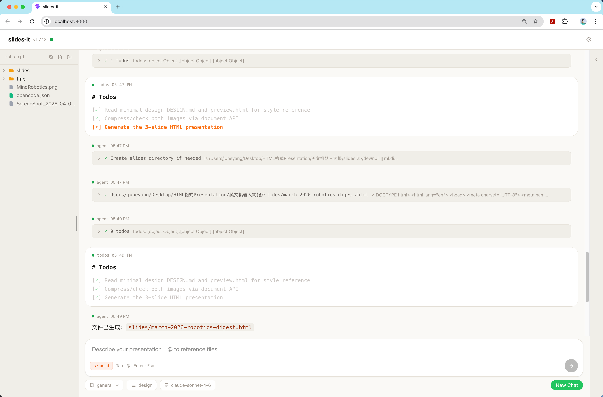

# slides-it

**Chat with AI. Get a presentation. One HTML file, ready to share.**

<p align="center">
  <a href="https://github.com/mengdigao1988/slides-it/releases"></a>
  
  
  
  
  <a href="https://opencode.ai"></a>
</p>

<p align="center">
  
</p>

---

# Getting Started

## Platform support

| Platform | Status |
|----------|--------|
| macOS (Apple Silicon) | Native binary |
| macOS (Intel) | Uses the arm64 binary — runs via Rosetta 2 automatically |
| Linux x86_64 | Native binary |
| Windows WSL2 | Uses the linux-x86_64 binary. The browser may not open automatically — visit `http://localhost:3000` manually |
| Windows (native) | Not supported |

## Step 0 — Open a terminal

slides-it is a command-line tool. If a terminal isn't part of the daily routine, here's how to open one:

- **macOS** — recommended: [Ghostty](https://ghostty.org/) (free, fast, beautiful). Or use the built-in Terminal.app: open Finder → Applications → Utilities → Terminal.
- **Linux** — most distributions include a terminal. Try `Ctrl + Alt + T`.
- **Windows** — install [WSL2](https://learn.microsoft.com/en-us/windows/wsl/install) first, then open the WSL terminal from the Start menu.

## Step 1 — Install

One command. The installer detects the platform, downloads the binary, and installs [OpenCode](https://opencode.ai) (the AI engine) automatically if it isn't already present.

```bash
curl -fsSL https://raw.githubusercontent.com/mengdigao1988/slides-it/main/install.sh | bash
```

After installation, run one more command to finish setup (only needed once — takes effect permanently, even after restarting the computer):

**macOS:**

```bash
echo 'export PATH="$HOME/.local/bin:$HOME/.opencode/bin:$PATH"' >> ~/.zshrc && source ~/.zshrc
```

**Linux / WSL2:**

```bash
echo 'export PATH="$HOME/.local/bin:$HOME/.opencode/bin:$PATH"' >> ~/.bashrc && source ~/.bashrc
```

## Step 2 — Launch

```bash
slides-it
```

A browser window opens to `http://localhost:3000`.

## Step 3 — Pick a workspace

The first screen asks for a **workspace folder** — the directory where generated slides will be saved.

<p align="center">
  
</p>

- Generated slides are saved as `.html` files inside this folder (e.g. `slides/q1-roadmap.html`).
- A `.slides-it/` directory is created automatically to store conversation history.
- Reopen the same folder later to pick up right where the last session left off.

Any folder works — a project directory, a `presentations/` folder, wherever makes sense.

## Step 4 — Set up an AI provider (optional)

slides-it works **out of the box** with free built-in models — no API key, no sign-up, no configuration needed. Just start chatting.

For access to higher-quality models (Claude, GPT-4, etc.), click the **⚙ settings icon** in the UI:

1. Pick a provider from the dropdown.
2. Paste an API key.
3. Hit Save — the change takes effect immediately.

<p align="center">
  
</p>

**Where to get an API key:**

| Provider | Sign up |
|----------|---------|
| Anthropic (Claude) | [console.anthropic.com](https://console.anthropic.com/) |
| OpenAI (GPT) | [platform.openai.com/api-keys](https://platform.openai.com/api-keys) |
| OpenRouter | [openrouter.ai/keys](https://openrouter.ai/keys) |
| DeepSeek | [platform.deepseek.com/api_keys](https://platform.deepseek.com/api_keys) |

<details>
<summary>Alternative: set an API key via environment variable</summary>

```bash
export ANTHROPIC_API_KEY=sk-ant-...
slides-it
```

| Provider | Env var |
|----------|---------|
| Anthropic | `ANTHROPIC_API_KEY` |
| OpenAI | `OPENAI_API_KEY` |
| OpenRouter | `OPENROUTER_API_KEY` |
| DeepSeek | `DEEPSEEK_API_KEY` |

For proxies, local models, or any OpenAI-compatible endpoint, open ⚙ settings and set a custom base URL. No env var needed.

</details>

---

# How it works

<p align="center">
  
</p>

Describe what the deck should cover. The AI handles layout, hierarchy, color, and animation — what used to take an hour of dragging boxes becomes a single conversation.

Need something different? Say so, and the whole deck updates. No undo history, no layer panels, no fighting with alignment guides.

The output is a finished, self-contained HTML file. Open it in any browser, share it with anyone, present it from anywhere — no export step required.

### Why HTML?

An AI agent reads and writes HTML natively. Every layout decision, every animation curve, every color relationship is text — written in one shot, revised with precision. The opaque binary formats that traditional slide tools produce were built for mouse-driven editing, not for AI generation. HTML is the natural output format.

Powered by [OpenCode](https://opencode.ai) — an open-source AI coding agent that runs locally and handles everything under the hood.

---

# Features

## Designs

Not just color swaps. Each design produces a distinctly different visual style — different typography, different spacing, different animation feel. The same content looks completely different under `default` (dark, cinematic) vs `minimal` (warm, typographic).

Switch with one click, mid-conversation. The very next response comes back in the new style.

<p align="center">
  
</p>

Two built-in designs ship with slides-it:

| Design | Vibe | Preview |
|--------|------|---------|
| `default` | Dark, modern, cinematic. Works for anything. | [preview](slides_it/designs/default/preview.html) |
| `minimal` | Warm off-white, typographic, paper-like. Lets the content breathe. | [preview](slides_it/designs/minimal/preview.html) |

Community designs can be installed from anywhere:

```bash
slides-it design install dark-neon          # official registry
slides-it design install github:user/repo   # any GitHub repo
slides-it design install ./my-design        # local directory
```

## Industries

Pick an industry, and the AI already knows the playbook. Choose `deeptech-investment` and it structures a 30-page investment report automatically — executive summary, technology deep-dive, risk analysis, competitive landscape — without needing to explain each section from scratch.

| Industry | What it does |
|----------|-------------|
| `general` | No specific structure — works for any topic |
| `deeptech-investment` | Deeptech VC investment reports (semiconductors, quantum, nuclear, biotech, etc.) |

Switch anytime in ⚙ settings. Mix and match with any design.

## Chat input

The input box is the entire interface. Type naturally — describe the deck, ask for changes, reference files with `@`, or switch designs from the pill selector built right in. No menus, no toolbars, no mode switching.

<p align="center">
  
</p>

## Live preview

Every generated deck shows up immediately in the right-hand panel. Navigate slides, swipe through, download with one click. The preview updates live as the AI makes changes.

## Session persistence

Close the app, come back tomorrow, reopen the same folder — the conversation is right where it was, and the last preview reloads on its own. No manual saving needed.

## Endless conversation

No "sorry, the conversation is too long" errors. Chat for as long as needed — slides-it handles the rest behind the scenes. Iterate on a 30-page deck across dozens of messages without hitting any limits.

## Token-saving

Reference any file — screenshots, PDFs, spreadsheets, design mockups — and slides-it handles the heavy lifting so the AI doesn't have to. Large images and lengthy documents are processed down to size before the AI reads them, cutting token usage by up to 95% per file and keeping API costs low. Just `@` a file and go.

---

# For Contributors

## Three-layer prompt architecture

slides-it assembles its AI system prompt from three independent layers, each with a strict, non-overlapping responsibility:

```
Layer 1: SKILL.md      — Core protocol (HOW to generate: conversation flow, HTML rules, tool usage)
Layer 2: INDUSTRY.md   — Domain knowledge (WHAT to generate: report structure, terminology, logic rules)
Layer 3: DESIGN.md     — Visual style (HOW it LOOKS: colors, fonts, animations, layout variants)
```

The layers are concatenated at runtime. Designs and industries are orthogonal — any combination works. This separation means a contributor can build a new visual style without touching content logic, or define a new industry without worrying about CSS.

See [AGENTS.md](AGENTS.md) for the full specification and responsibility boundaries.

## Build your own design

A design is a directory containing a `DESIGN.md` file — a **visual brief for the AI**, not documentation for humans. The AI reads it before every generation and follows it precisely.

### 1. Create the directory

```
my-design/
├── DESIGN.md
└── preview.html    ← recommended
```

`preview.html` is a reference slide deck that demonstrates the design in action. The AI can read it to understand the intended visual output, and it helps other contributors quickly evaluate the design without installing it. See the built-in designs ([default](slides_it/designs/default/preview.html), [minimal](slides_it/designs/minimal/preview.html)) for examples.

### 2. Write `DESIGN.md`

The file starts with YAML front matter, followed by the visual specification:

```markdown
---
name: my-design
description: One-line description of the visual style
author: your-name
version: 1.0.0
preview: https://example.com/preview.png   # optional
---

## Visual Style — My Design

Apply this visual style when generating all slides in this session.

### Color Palette
\`\`\`css
:root {
    --bg-primary:   #your-color;
    --text-primary: #your-color;
    --accent:       #your-color;
    --border:       #your-color;
}
\`\`\`

### Typography
- Display font: `Font Name` — load from Google Fonts / Fontshare
- Body font: `Font Name`
- Title size: `clamp(2rem, 5vw, 4rem)`

### Slide Layout
- Padding, max-width, alignment preferences

### Animations
- Entrance style, duration, easing

### Do & Don't
- **Do** use [specific things]
- **Don't** use [specific things]
```

The more precise and opinionated the spec, the more consistent the output. See [`slides_it/designs/default/DESIGN.md`](slides_it/designs/default/DESIGN.md) and [`slides_it/designs/minimal/DESIGN.md`](slides_it/designs/minimal/DESIGN.md) for real examples.

### 3. Install and test

```bash
slides-it design install ./my-design
```

Launch slides-it, select the new design from the pill selector below the input box, and generate a deck. Iterate on `DESIGN.md` until the output matches the vision.

### 4. Share

Publish the design as a GitHub repo. Others can install it with:

```bash
slides-it design install github:yourname/my-design
```

Or submit a PR adding it to [`registry.json`](registry.json) to list it in the official registry.

## Build your own industry

An industry is a directory containing a single `INDUSTRY.md` file. It defines content structure, AI logic rules, and domain terminology — everything about *what* the AI should generate, independent of visual style.

### 1. Create the directory

```
my-industry/
└── INDUSTRY.md
```

### 2. Write `INDUSTRY.md`

```markdown
---
name: my-industry
description: One-line description of the domain
author: your-name
version: 1.0.0
---

# Industry Definition

## Report Structure
Define sections, ordering, and page allocation for this domain.

## Information Mapping
What document types map to which report sections.

## AI Logic Rules
Domain-specific evaluation criteria, weighting, evidence standards.

## Terminology
Key terms, naming conventions, abbreviations used in this field.
```

**Important:** `INDUSTRY.md` should only contain domain knowledge. Research workflows, tool usage, curl commands, and HTML generation rules belong in `SKILL.md` (Layer 1) and must not be duplicated here.

See [`slides_it/industries/deeptech-investment/INDUSTRY.md`](slides_it/industries/deeptech-investment/INDUSTRY.md) for a real example.

### 3. Install and test

Industries can be installed via the API (`POST /api/industries/install`). Launch slides-it, activate the new industry from the settings panel, and test with a few prompts.

## Development setup

Requires [uv](https://docs.astral.sh/uv/) and Node.js 22+.

```bash
git clone https://github.com/mengdigao1988/slides-it.git
cd slides-it

# Backend — FastAPI on port 3000
uv run python -c "from slides_it.server import run; run(port=3000)"

# Frontend — dev server on port 5173
cd frontend && npm install && npm run dev

# Production build
cd frontend && npm run build

# Standalone binary
bash build.sh
```

### CLI reference

```
slides-it                           launch the web UI
slides-it --version                 show version
slides-it stop                      stop everything

slides-it design list               list installed designs
slides-it design search             search the official registry
slides-it design install <src>      install a design
slides-it design remove <name>      remove a design
slides-it design activate <name>    set the active design
```

---

# License

MIT
