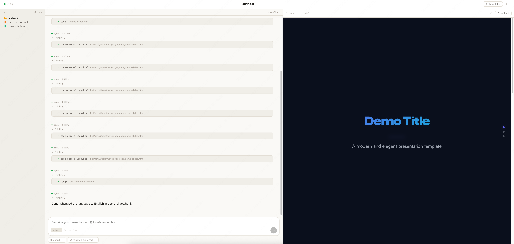

# slides-it

**Stop making slides. Start making points.**



---

You open a slide tool. You pick a template. You spend 45 minutes nudging text boxes, fighting with fonts, and arguing with alignment guides. You end up with something that looks almost — but not quite — like what you had in your head.

There's a better way.

**Type what you want. Get a beautiful slide deck. Done.**

slides-it turns a plain-language description into a complete, self-contained HTML presentation — stunning animations, perfect typography, keyboard navigation, works in any browser. No design skills. No templates to fight. No software to install on the other end.

---

## What it looks like

> "8 slides on our Q1 roadmap. Audience is the whole company. Punchy, confident tone."

Thirty seconds later: a polished deck lands in your workspace. Arrow keys to navigate. Swipe on mobile. Share it as a single `.html` file — no slide tool required, no account needed, no export dance.

Want changes?

> "Make the opening slide more dramatic. Add a slide on pricing. Lighter color scheme."

Done. The whole deck is regenerated with your changes applied. You never touched HTML.

---

## Why HTML

HTML has always been the superior format for slides. Fluid animations. Pixel-perfect layout. Runs everywhere. No proprietary app required. Nobody used it because nobody wanted to write it by hand.

AI changes that equation completely.

An AI agent doesn't struggle with HTML — it's fluent in it. Every layout decision, every animation curve, every color relationship can be expressed as text, written in one shot, revised with surgical precision. Compare that to the opaque binary formats that GUI slide tools produce, built for humans dragging boxes around a canvas. Asking an AI to work with them is fighting the format.

slides-it skips the GUI entirely. Your words go in. A beautiful file comes out.

Powered by [OpenCode](https://opencode.ai) — an open-source AI coding agent that runs locally and handles everything under the hood.

---

## Features

### Templates that actually mean something

Most "templates" are just color schemes slapped on the same layout. slides-it templates are different — each one is a complete visual brief that tells the AI exactly how to design: which fonts carry authority, how much whitespace breathes, what animation style fits the mood, how color creates hierarchy.

Switch templates mid-conversation with one click. The AI is immediately re-briefed and applies the new aesthetic to everything going forward.

Ships with two:

| Template | Vibe |
|----------|------|
| `default` | Dark, modern, cinematic. Works for anything. |
| `minimal` | Warm off-white, typographic, paper-like. Lets the content breathe. |

Install more from the registry, from any URL, or build your own:

```bash
slides-it template install dark-neon          # official registry
slides-it template install github:user/repo   # any GitHub repo
slides-it template install ./my-template      # local directory
```

### Memory across sessions

Your conversation lives in `.slides-it/session.json` inside your workspace. Close the app, come back tomorrow, reopen the same folder — your full chat history is right where you left it, and the last preview reloads automatically. No starting over.

### Built-in workspace browser

Navigate your project files directly in the sidebar. Click any `.html` file to preview it instantly — no context-switching, no separate browser tab.

### Live preview panel

Every generated deck opens immediately in the right-hand panel. It's fully interactive: keyboard navigation, swipe, progress bar. When you ask for changes, the preview updates the moment the file is rewritten. Download with one click.

---

## Install

**Requires [OpenCode](https://opencode.ai):**

```bash
curl -fsSL https://opencode.ai/install | sh
```

**Then install slides-it:**

```bash
curl -fsSL https://raw.githubusercontent.com/slides-it/slides-it/main/install.sh | bash
```

**Run:**

```bash
slides-it
```

A browser window opens. Pick a workspace folder. Start talking.

Set your Anthropic API key in the ⚙ settings panel — or pass it in your environment:

```bash
export ANTHROPIC_API_KEY=sk-ant-...
slides-it
```

---

## CLI

```
slides-it                          launch the web UI
slides-it --version                show version
slides-it stop                     stop everything

slides-it template list            list installed templates
slides-it template search          search the official registry
slides-it template install <src>   install a template
slides-it template remove <name>   remove a template
slides-it template activate <name> set the active template
```

---

## Development

Requires [uv](https://docs.astral.sh/uv/) and Node.js 22+.

```bash
# Backend — FastAPI on port 3000
uv run python -c "from slides_it.server import run; run(port=3000)"

# Frontend — dev server on port 5173
cd frontend && npm install && npm run dev

# Production build
cd frontend && npm run build

# Standalone binary
bash build.sh
```

---

## License

MIT
